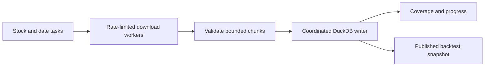

# Fyers historical candle download plan

Date: 2026-09-08  
Status: Planning only; no implementation or download has been performed.  
Repository reviewed at: `e6ae05bf0`

## Objective and scope

Download approximately nine years of OHLCV candles for 1,500 stocks from Fyers,
store them in Historify's DuckDB database, and reuse the data for local backtests.
After the initial historical load, maintain the dataset with daily incremental
downloads and targeted gap repair.

The user's interval text was interpreted as **5-minute candles**. Confirm this
interpretation before implementation. NSE cash equities are the working exchange
assumption. The exact stock list, date boundaries, and Fyers account tier remain
to be confirmed.

Keep DuckDB and extend Historify. Prioritize native 5-minute storage, larger
request windows, durable chunk recovery, and account-wide rate limiting.

## Current implementation findings

These are observations from the code, not results from a runtime benchmark.

| Area | Current behaviour | Consequence |
|---|---|---|
| Download intervals | Historify stores downloads as `1m` or `D`; `5m` is computed from `1m` | A 5-minute backtest currently requires downloading more candles than necessary |
| Job execution | A shared executor defaults to five workers, but each submitted job loops through its stocks sequentially | Increasing `HISTORIFY_MAX_WORKERS` alone does not parallelize stocks within one job |
| Job pauses | Default 1-3 seconds after each normally processed stock, plus 5-10 seconds every ten | A fresh 1,500-stock job adds about 68.75 minutes of expected waiting, excluding network and writes; some incremental paths bypass these pauses |
| Fyers chunk size | Minute/hour history is split into 60-calendar-day windows | More requests than a validated 100-day window would require |
| Rate control | The history service has separate pacing; the Fyers limiter spaces requests but does not explicitly track minute/day budgets | More workers alone can exceed longer-window limits |
| Persistence | Historify saves the returned stock/range after the broker adapter finishes its internal chunk loop | Long requests lack durable progress at each broker chunk |
| Failure reporting | The Fyers adapter can skip a failed chunk after retries and return the other chunks | A successful outer response does not prove complete coverage |
| Incremental coverage | Checks first/last stored timestamps and extends the edges | Internal gaps can be overlooked |
| Database insertion | Bulk DataFrame insertion with conflict updates already exists | Preserve bulk insertion; measure catalog scans and connection overhead before optimizing them |

Relevant files:

- [Historify service](../../services/historify_service.py)
- [History service](../../services/history_service.py)
- [Historify database operations](../../database/historify_db.py)
- [Fyers history adapter](../../broker/fyers/api/data.py)
- [Fyers rate limiter](../../broker/fyers/api/rate_limiter.py)
- [Historify routes](../../blueprints/historify.py)
- [Historify frontend](../../frontend/src/pages/Historify.tsx)
- [Historify scheduler](../../services/historify_scheduler_service.py)
- [Existing architecture](../design/08-historify/README.md)
- [Existing download-engine requirements](../prd/historify-download-engine.md)

## Fyers coverage and limits

Sources reviewed on 2026-09-08. Recheck these before implementation because
provider limits and account entitlements can change.

Fyers' developer reference lists minute history from **3 July 2017**, a maximum
of **100 days per minute-resolution request**, and resolution `5` for 5-minute
candles. This is a provider-wide availability statement, not a guarantee that
every current stock has complete history from that date. IPOs, symbol changes,
suspensions, and provider coverage affect each instrument.

Source: [Fyers market-data reference](https://github.com/FyersDev/fyers-skills/blob/master/skills/fyers-trading/references/market-data.md).

The Fyers support plan comparison publishes:

| Account plan | Requests/second | Requests/minute | Requests/day |
|---|---:|---:|---:|
| Standard | 10 | 200 | 100,000 |
| Prime | 10 | 600 | 200,000 |

Source: [Fyers Standard and Prime comparison](https://support.fyers.in/portal/en/kb/articles/is-fyers-prime-mandatory-to-trade-on-fyers).

Use Standard as the planning default until the actual tier is known. Budget
other account traffic and retries alongside downloads. The per-second allowance
does not mean that the same rate can be sustained for an entire minute on Standard.

## Workload and time estimates

Planning assumptions: nine years, approximately 250 trading days/year, 375 minutes
per normal NSE cash session, and all 1,500 stocks existing throughout the period.
Actual counts vary with calendars, listing dates, special sessions, and no-trade bars.

| Measure | Estimate |
|---|---:|
| Trading days per stock | 2,250 |
| 5-minute candles per normal session | 75 |
| 5-minute candles per stock | 168,750 |
| Total 5-minute candles | 253,125,000 |
| Equivalent 1-minute candles | 1,265,625,000 |
| Requests per stock with 100-calendar-day windows | About 33 |
| Total requests with 100-day windows | About 49,500 |
| Total requests with current 60-day windows | About 82,500 |

Native 5-minute downloads reduce candle volume approximately fivefold relative
to 1-minute downloads. Changing 60-day windows to 100-day windows reduces request
count approximately 40%. These are different savings: changing resolution alone
does not reduce request count when the permitted date window stays the same.

At Standard's maximum 200 requests/minute, 49,500 requests imply a theoretical
request-budget minimum of about **4 hours 8 minutes**. At a proposed conservative
120-150 requests/minute, pacing alone takes **5.5-6.9 hours**. These are not
completion promises. Network latency, payload size, disk throughput, throttling,
retries, and authentication interruptions can increase elapsed time.

Measure compressed size, database/index growth, temporary disk use, and peak RAM
in the pilot. Do not infer an exact storage requirement from row count alone.

## Proposed implementation phases

### 1. Validate a representative sample

- Confirm interval, stock universe, date boundaries, account tier, and available disk/RAM.
- Sample about 20 stocks: long-listed companies, recent IPOs, renamed symbols, and less actively traded securities.
- Request native 5-minute candles for recent and early historical windows.
- Validate 100-day inclusive boundaries without accidental 101-day requests.
- Check timestamps, first available dates, duplicate boundaries, and corporate-action treatment.
- Measure actual HTTP requests, response latency, payload bytes, parsing time, write time, retries, and resource usage.
- Check whether the source revises older adjusted history after corporate actions; a recent overlap alone would not repair those revisions.

### 2. Support native 5-minute data throughout Historify

- Extend download validation and interval selection to permit stored `5m` candles.
- Update reads, exports, catalog views, scheduling, and backtest loading to use native `5m` data when selected.
- Define explicit fallback behaviour for existing datasets that only contain `1m` data.
- Define how higher intervals can be derived from stored `5m`, aligned to the exchange session; do not imply that `5m` can reconstruct finer candles.
- Preserve existing `1m` and `D` datasets and workflows.
- Keep candle source and adjustment policy consistent within a published dataset; avoid silently mixing native and resampled candles.
- Any required schema change must ship with an idempotent migration registered in `upgrade/migrate_all.py`.

### 3. Track durable stock/date tasks

Represent each task by symbol, exchange, interval, start/end dates, source, status,
attempt count, and diagnostic details. Use validated windows of up to 100 calendar
days, starting no earlier than the requested date, provider availability, and known
listing date.

- Save each successful window immediately instead of accumulating nine years for one stock in memory.
- Commit candles and the corresponding completion state atomically where possible.
- Make retries idempotent using the existing candle identity: symbol, exchange, interval, timestamp.
- Resume unfinished windows after a restart, token renewal, pause, or cancellation.
- Distinguish complete, partial, failed, and confirmed-unavailable windows.
- Do not turn a transient error or unexplained empty response into a completed window.
- Ensure the Fyers adapter's partial failures reach the task scheduler rather than disappearing inside a combined response.

### 4. Coordinate concurrent downloads and rate limits

Start with 2-4 concurrent requests and tune from measurements. Apply one shared
budget to every actual Fyers HTTP request, including adapter chunks and retries.
Extend the existing limiter rather than introducing independent competing limits.

- Enforce second, minute, and day windows with headroom for other account activity.
- Start around 120-150 history requests/minute on Standard when the remaining account budget permits.
- Replace arbitrary job cooldowns only after the coordinated limiter is validated.
- Honour retry headers and use bounded backoff for transient failures.
- Pause affected work for expired authentication; resume after valid authentication is restored.
- Prioritize interactive trading/account requests over historical backfill when both are active.
- Preserve compatibility with standard threading in development and eventlet in production.
- A separate worker process would require explicit coordination of both account limits and DuckDB ownership; do not assume module globals span processes.

### 5. Coordinate DuckDB ingestion and backtest access

- Retain bulk inserts and bound queued data by memory/bytes, not only task count.
- Use one coordinated writer for this ingestion pipeline and keep the live database owned by one process.
- Measure and reduce repeated catalog scans while keeping counts correct after overlapping upserts.
- Consider durable Parquet staging if it materially improves recovery from write failures; compact small staging files if retained for research.
- Publish an immutable Parquet dataset or a consistent DuckDB snapshot for backtests running in another process during ingestion.
- Do not copy an actively written database file as an ad hoc snapshot or assume `read_only=True` bypasses a live writer's file lock.
- Load only required symbols, dates, and columns for backtests; avoid materializing all 253 million rows in pandas by default.

DuckDB's embedded concurrency model supports writer threads within one writer
process. The proposed single writer is an ingestion design choice, not a claim
that DuckDB cannot support concurrent threads. DuckDB also supports direct Parquet
queries. Sources: [DuckDB concurrency](https://duckdb.org/docs/current/connect/concurrency),
[DuckDB Parquet support](https://duckdb.org/docs/current/data/parquet/overview).

### 6. Validate coverage and maintain the dataset

- Detect internal gaps using task coverage and exchange calendars, not only first/last timestamps.
- Distinguish holidays, suspensions, pre-listing dates, and genuine no-trade periods from missing downloads; do not blindly synthesize missing OHLCV bars.
- Validate timestamp units, UTC storage, IST session interpretation, ordering, OHLC relationships, nonnegative volume, and duplicates.
- Record unavailable symbols/date windows explicitly, including unresolved historical symbol mappings.
- Record source, download time, adjustment policy, and dataset version for reproducibility.
- Decide whether research uses today's 1,500 stocks or historical membership. Today's surviving stocks alone introduce survivorship bias into historical universe-level conclusions.
- After initial loading, schedule updates after market close with a small recent overlap for corrections.
- Repair internal gaps and older corporate-action revisions separately from ordinary daily updates.

Normal daily maintenance is approximately **1,500 requests and 112,500 new
5-minute candles**, before retries and overlap. Prefer one grouped request per
stock covering the recent overlap instead of one request per stock per day.

### 7. Roll out progressively

Expand from 20 stocks to 100, then to 1,500 only after evaluating correctness,
throughput, and resource use. Show progress by completed windows and candles,
with failed/unavailable windows separate. Derive ETA from measured throughput.

## Acceptance criteria

- Native `5m` downloads, reads, exports, schedules, and backtest loading work without regressing existing intervals.
- A restart resumes unfinished windows without repeating completed history.
- Replaying a completed chunk does not create duplicate candles or inflate catalog counts.
- Partial broker responses and failures leave visible, retryable missing windows.
- Actual requests stay within the configured account budgets across concurrent jobs and retries.
- Expired authentication pauses downloads instead of consuming repeated failed requests.
- Memory and disk usage remain bounded during the full workload.
- Every requested stock/window has a validated completion state or an explicit unresolved/unavailable reason.
- Backtests can select a stable dataset version independent of ongoing ingestion.
- Runtime validation includes the project's production eventlet constraints; changes involving database connections, threads, files, or sockets receive the repository's required resource audit.

## Outstanding decisions before implementation

- Confirm that the requested interval is 5 minutes.
- Obtain the exact stock list and exchanges, and define how historical symbol changes are handled.
- Set exact start/end dates and confirm Standard versus Prime entitlement.
- Measure machine resources and choose a backtest snapshot format from the pilot.
- Confirm source adjustment behaviour and whether historical universe membership is required.

This document records the future implementation plan only. It does not authorize
placing trades, purchasing a data subscription, or starting a bulk download.
